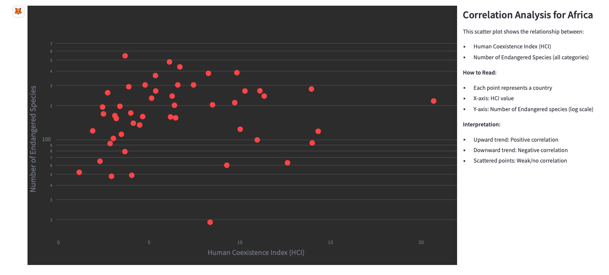

# Test Prompts for Biodiversity Application

❗ **IMPORTANT LIMITATIONS:** ❗Application database only includes **Mammals** and protected areas are only availble in **Africa**. 

## Basic Species Information
- What is the scientific name for Bornean Orangutan?
- List all orders with endangered species for class Mammalia
- List all families for primates with the number of endangered species 
- Show all endangered species in the family of HOMINIDAE with link to IUCN
- Show the taxonomy of Bornean Orangutans
- Tell me about Bengal Tiger

## Geographic Distribution Queries
- Where can I find Orangutans in the wild?
  

- Map the distribution of Lions in East Africa
  
- In which countries can I find Giant Pandas?
- Show the habitat of lions as heatmap
  

## Protected Areas Analysis
- What endangered species live in Serengeti?
- Show me protected areas in Kenya
  
- Show me the observations of lions in the Serengeti

## Conservation Status Analysis
- How many critically endangered species are there in Madagascar?
- List the number of endangered species per conservation status for Germany
- List the endangered species for Germany with status Critically Endangered
- Show me endangered families in the order Primates
- What's the breakdown of threatened species in Brazil by conservation status?

## Human Impact Analysis
- Show me the human coexistence index for Tanzania
  
- What's the human coexistence index around Masai Mara?
- Compare human impact on wildlife between Kenya and Zambia

## Temporal Analysis
- How have Lion sightings changed over the past decade?
- Show yearly occurrence data for Tigers in India
- Compare elephant populations over time in Kenya and Tanzania
  

## Complex Multi-Function Queries
- Compare the endangered species for Germany and Spain with status Critically Endangered
- Show me endangered primates in African countries with high population density
- What's the correlation between human coexistence index and endangered species count?
  
  
