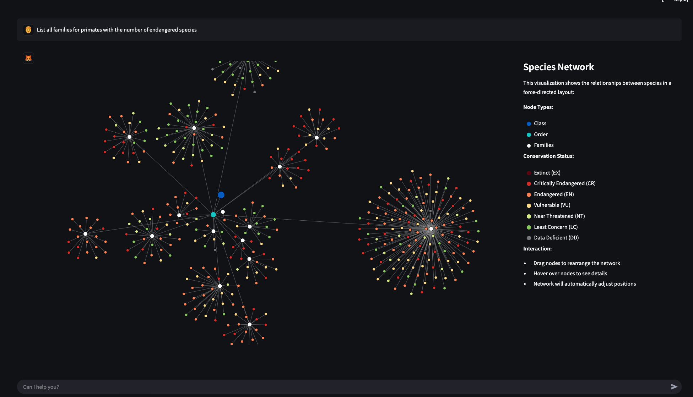

# Test Prompts for Biodiversity Application

❗ **IMPORTANT LIMITATIONS:** ❗Application database only includes **Mammals** and protected areas are only availble in **Africa**.

## Basic Species Information
- List all families for primates with endangered species
- What is the scientific name for Bornean Orangutan?

  

- Show all endangered species in Germany as tree chart

  

## Geographic Distribution Queries
- Show endangered species locations in Kenya

  

- Where can I find Bornean Orangutans in the wild?

  

- In which countries can I find Giant Pandas?
- Show the habitat of lion as heatmap

  

## Protected Areas Analysis
- What endangered species live in Serengeti?
- What national parks are in Tanzania?
- Display wildlife reserves in Uganda
- Show me protected areas in Kenya

  
- Show me the observations of lions in the Serengeti

## Conservation Status Analysis
- Show me the species per conservation status are in Kenya.
- List the number of endangered species per conservation status for Germany
- List the endangered species for Germany with status Critically Endangered
- Show me endangered families in the order Primates
- What's the breakdown of  endangered species in Brazil by conservation status?

## Earth Engine Analysis
- Analyse habitat distribution of Bornean orangutan

  

- Analyse habitat distribution of Bornean orangutan
  

- How does orangutan distribution relate to forest cover?

  

- Analyze topography for Gorilla beringei

  

- Analyze climate for Gorilla beringei

  

- Show human modification correlation for Bornean Orangutan

## Human Coexistence Index

- Analyze the correlation between human coexistence index and critically endangered species

  

- Analyze the correlation between human coexistence index and species in Kenya

  

- Show me the terrestrial human coexistence index for Tanzania

  

- Compare human impact on wildlife between Kenya and Zambia

## Temporal Analysis
- How have Lion sightings changed over the past decade?
- Show yearly occurrence data for Tigers in India
- Compare lion populations over time in Kenya and Tanzania

  

## Edge cases
- What is the current population of blue whales in the Pacific Ocean?
- When was the last sighting of the Ivory-billed Woodpecker?
- How many Sumatran Rhinos are left in the wild as of 2024?
- What conservation efforts are being made to protect the Vaquita porpoise?
- Which countries still have wild populations of Snow Leopards?

## Link to the Video
https://appsolutelydigital.com/BioChat.mp4

